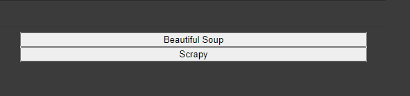
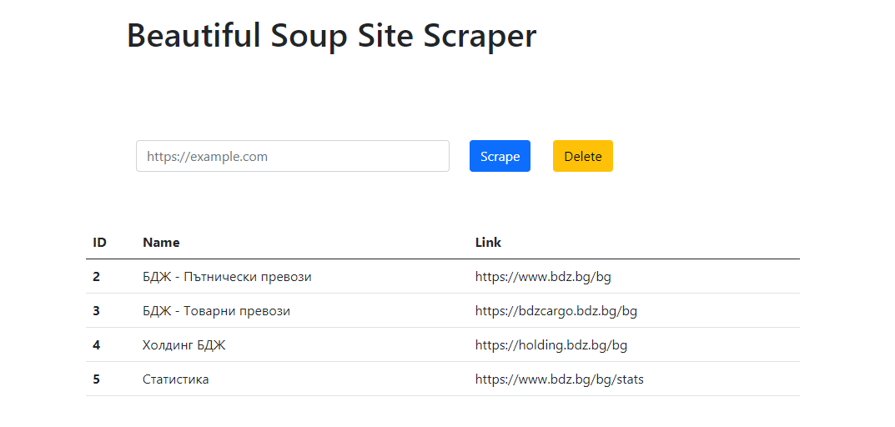
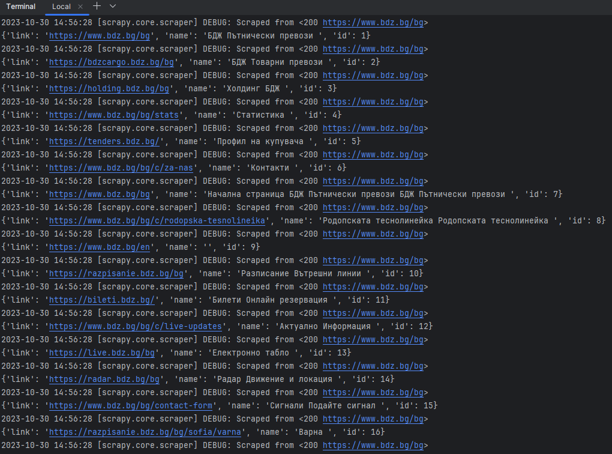

# ScrapyVsBs4

It's a demo web app that compares the abillities of scraping of Beautiful Soup and Scrapy

You are choosing an engine on the index page and then you are searching for links and their text in the chosen site.
The working part (with interface is the BS one)

# index:

# bs search results

# scrapy console results:

